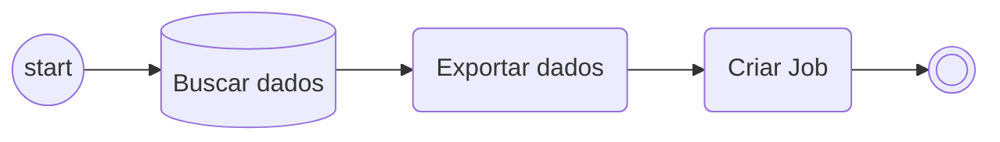
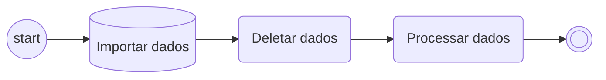

# Export Database

Um programa será chamado duas vezes. Na segunda vez, provavelmente em uma execução por job, terá acesso a dados que foram lidos de um arquivo/ficheiro ~~neste caso, só uma tabela interna porque eu não vou criar tudo~~ na primeira vez.

## Necessidade ##
Em alguns casos, existe a necessidade de:
- Informar dados para processamento
- Informar também um arquivo
- Habilitar uma opção de processamento em background

Dessa forma, o programa irá buscar os dados de um arquivo Excel, por exemplo, e isso irá gerar um processamento em background com esses dados e/ou os dados da tela inicial. Para esse tipo de solução, é comum usar uma chamada do mesmo programa, criando um job ou algo nessa linha.

Para casos assim, é interessante buscar os dados do arquivo antes de fazer a chamada do programa novamente (via job etc). Infelizmente não é possível um job ler um arquivo que está no computador do usuário (apenas arquivos no próprio servidor), por isso, seria interessante ler esses dados e guardar de forma que possam ser acessados pelo job em um segundo momento. Para essa necessidade que este programa foi criado.

## Tecnologia adotada ##
ABAP usando `export/import ... database` ~~por usar export memory só dá trabalho e os dados ficam perdidos em nárnia~~ para gerir o export/import de dados. 

## Solução ##
O programa será executado duas vezes e em cada uma terá uma funcionalidade diferente:
1- Buscar, exportar os dados e gerar o job
2- Recuperar os dados e processá-los

### Fase 1 - busca, exportação e criação de job ### 
Para essa parte, o fluxo seguido será:
- Informar os dados de processamento
    - Arquivo
    - Dados necessários
    - Etc
- Executar o programa para importação dos dados do arquivo ~~que nesse caso, eu vou informar manualmente porque eu não quis criar as rotinas de importar do Excel~~
- Exportar os dados para a tabela `Cluster DataBase`
- Criar o job passando o `ID` gerado para esses dados

### Fase 2 - Importação e processamento ###
Essa parte já será executada como job. A partir desse ponto segue-se o seguinte fluxo:
- Importar os dados da tabela `Cluster DataBase`
- Eliminar os dados da tabela
- Processar os dados 

**Esse código é aberto, sujeito a alterações ~~a hora que me der na telha~~ assim que houver uma necessidade que trará ganho didático ao conteúdo e deixe o algoritmo com melhor leitura e compreensão.**

## Exemplo

Você pode ver o exemplo neste [arquivo](/class/cluster.abap).