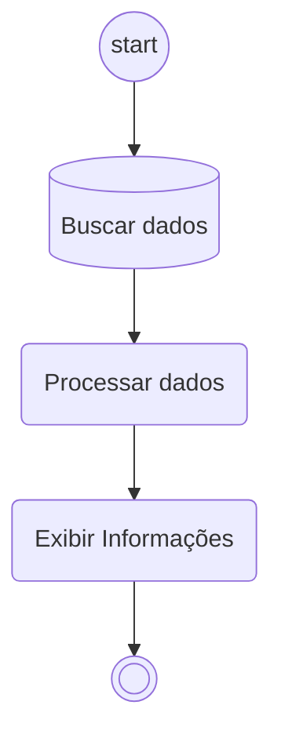

# Double call program

Um programa será chamado duas vezes. Na segunda vez, provavelmente em uma execução por job, ter acesso a dados que foram lidos de um arquivo/ficheiro na primeira vez.

## Necessidade ##
Em alguns casos, existe a necessidade de, em um report:
- Informar dados para processamento
- Informar tambem um arquivo
- Habilitar uma opção de processamento em background

Dessa forma, o programa ira buscar os dados do arquivo excel por exemplo, e isso ira gerar um processamento em background com esses dados e/ou os dados da tela inicial. Para esse tipo de solução, é comum usar uma chamada do mesmo programa, criando um job ou algo assim. 

Para casos assim, é interessante buscar os dados do arquivo antes de fazer a chamada do programa novamente (via job ou algo assim). Infelizmente não é possivel um job ler um arquivo que esta no computador do usuario (apenas arquivos no proprio servidor), por isso, seria interessante ler esses dados e guardar de forma que possam ser lidos pelo job em um segundo momento. Para esse necesssidade que este programa foi criado.

## Tecnologia adotada ##
ABAP usando `cl_salv_bs_runtime_info` para recuperar os dados do relatório. Modulos de funções para mater variantes temporarias. 

## Solução ##
A variante é gerada por um periodo de um mês. A Solução ira dividir isso partes/cotas e salvar isso em `EXPORT lt_data FROM lt_data TO DATABASE indx(ZZ) ID key.` . Apos isso, salvar isso no server.

## Fluxo do projeto ##
~~Para usar um grafico Mermaid~~ Para melhor entendimento do processo, segue abaixo fluxo .

**Esse código é aberto, sujeito a alterações ~~a hora que me der na telha~~ assim que houver uma necessidade que trará ganho didático ao conteúdo e deixe o algoritmo com melhor leitura e compreensão.**

## Example

You can see the example on this [file](cluster.abap).

## EN Version ##
That will use a dynamic table as a filter on the select instruction, only the screen fields that have been filled. The empty screen fields are going not to be considered.

##